#                                                        Operating Systems Lab 

#                                                                                                   Lab # 3

# Task#01:

###### You are required to help a new Linux user. Mr. Tom is new Ubuntu user. He wants guidance regarding shell scripting to  perform following tasks:

##### 1. Create a simple script which will take two command line arguments and  then multiply them together.

#### Script and Result of Question#1:

you need to use the "touch" command to create a new file on Ubuntu. The format of this command is as follows.  

#####  Format:  touch file_name.txt 

- This is how we can use this command to create file named  "task1.txt".

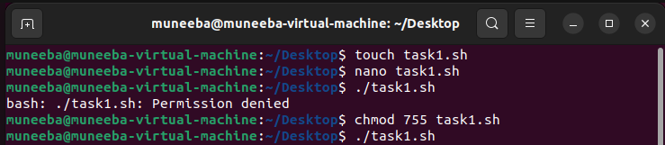

- Now to write the content in these above file named "task1.txt" we need to use the nano command to open the files( "task1.txt") in the text editor and write the script in the file. The script is as follows:

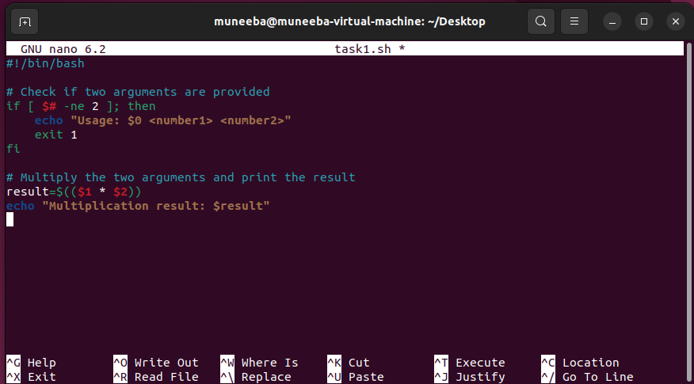

- This is the result of the script.

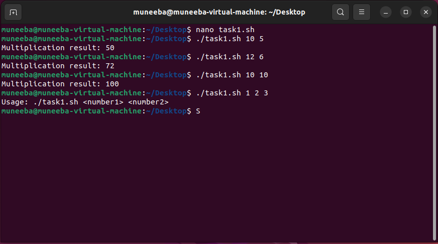

- Here the passing arguments are multiplied together to give the result.
- If the number of passed arguments is greater or less than two then the command will not work properly.

##### 2. Create a simple script, which will ask the user for a few pieces of  information then combine this into a message which is echo'd to the screen.

#### Script and Result of Question#2:

- Here's the script which will ask the user for his/her Name,Dep_Name,Reg_Number which then combine this into a message which is echo'd to the screen later.

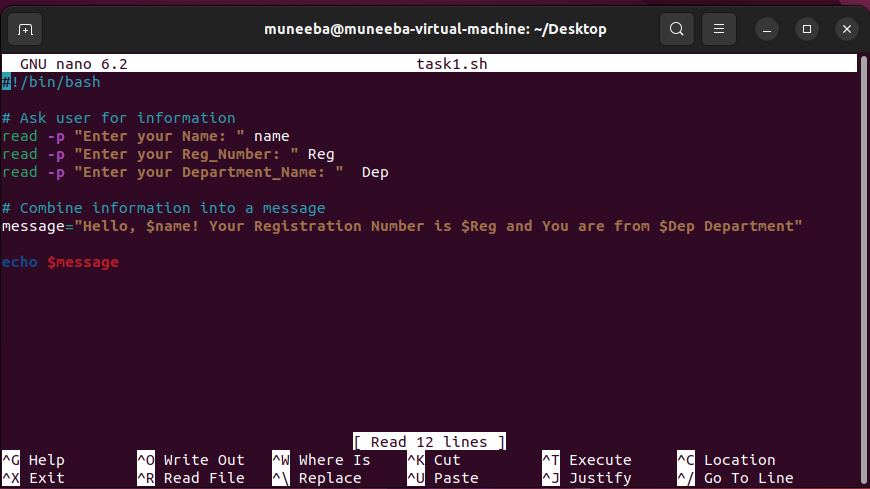

- Here's the result.

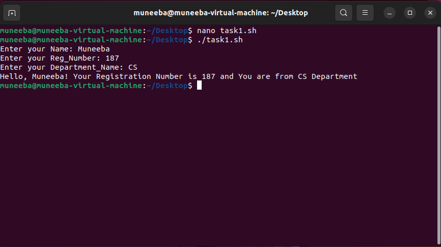

##### 3. Now Mr. Tom suddenly lost the track of his current location. Help him find his location.

#### Script and Result of Question#3:

- Here's the script for checking the current location of Mr. Tom/Present working Directory of Mr. Tom.

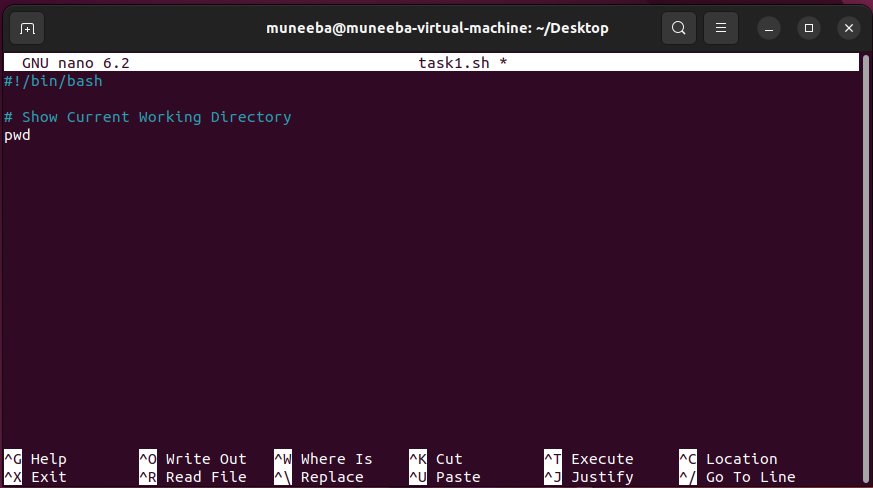

- Here's the result of above script.

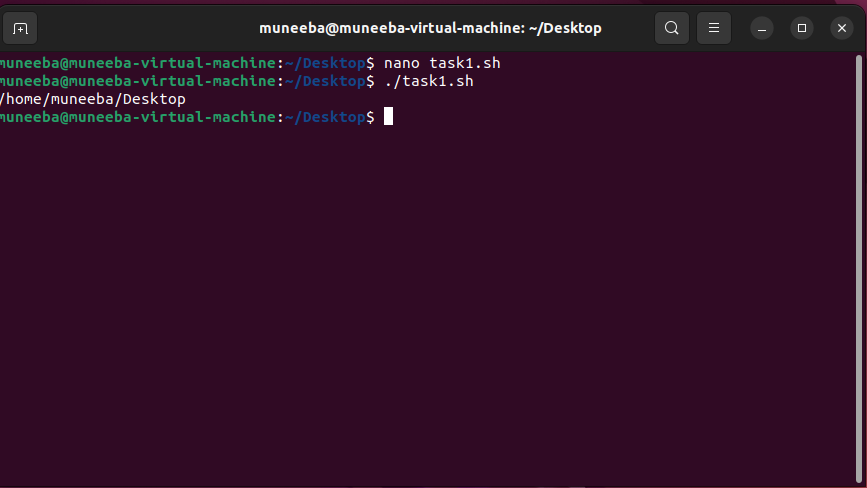

##### 4. He wants the list of all files present on home directory.        

#### Script and Result of Question#4:

- Here's the script for checking the names of all files present on home directory.      

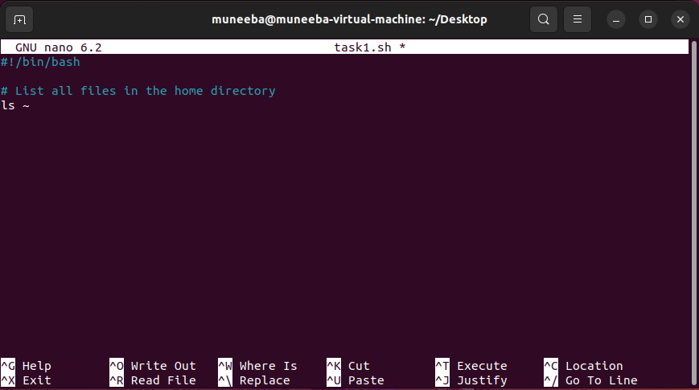

- Here's the result of above script.

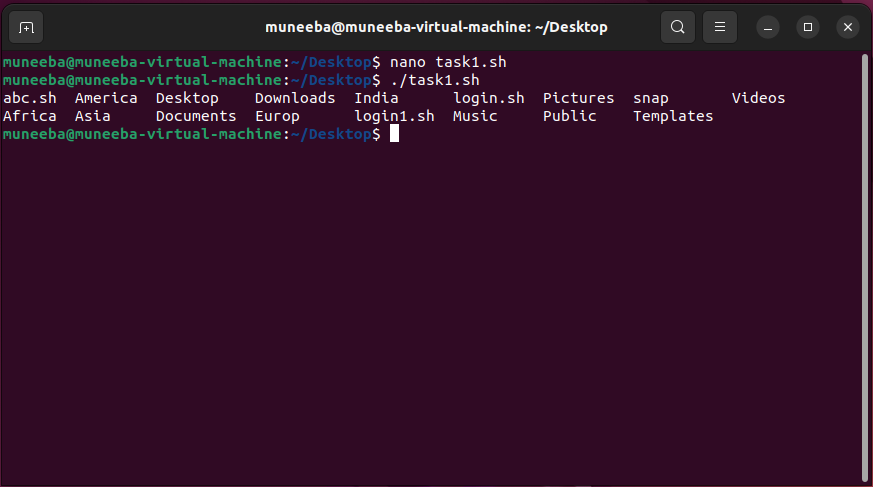

#####  5. Display the current time and date.

####  Script and Result of Question#5:

- Here's the script for Displaying the current time and date.

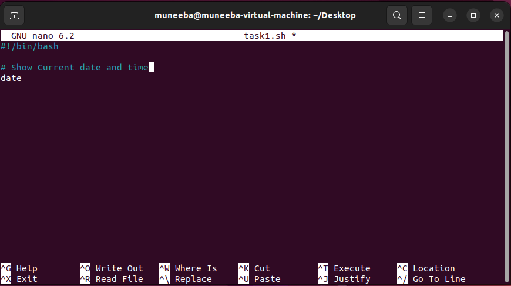

- Here's the result of above script.

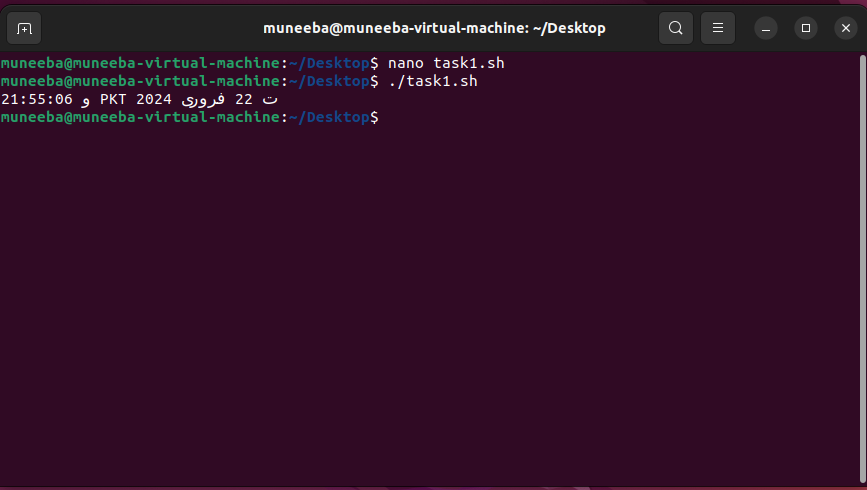

##### 6. He is done with the task and he is happy with your work. He want to  display a thankyou message.

#### Script and Result of Question#6:

- Here's the script for thank you message.

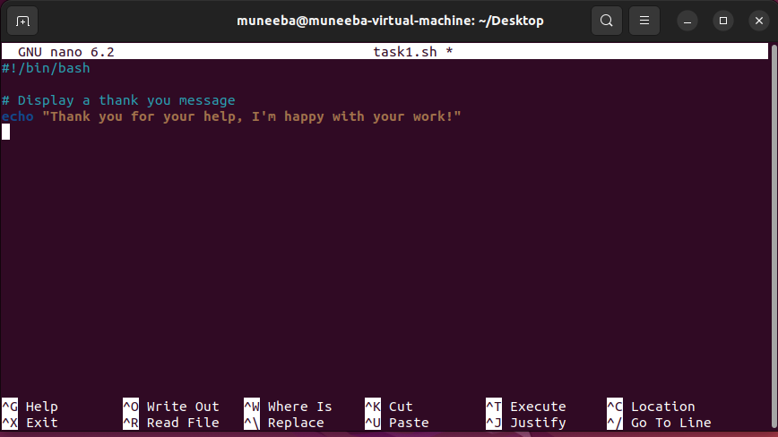

- Here's the result of above script.

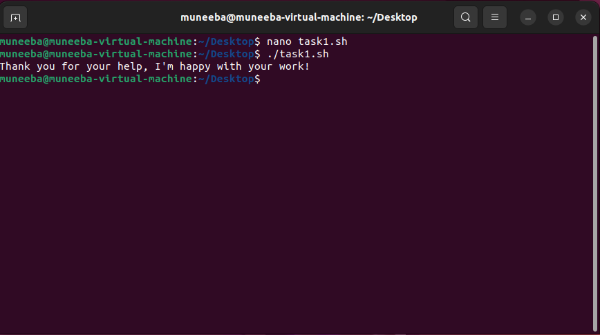

# Task#02:

##### 1. Write a simple shell script that uses arithmetic operators (+, -,*) using  double parenthesis with printing your own roll # with the results of  operations.

#### Script and Result of Question#1:

- Here's the shell script that uses arithmetic operators (+, -,*) using  double parenthesis with printing my  Registration Number with the results of the arithmetic operations performed.

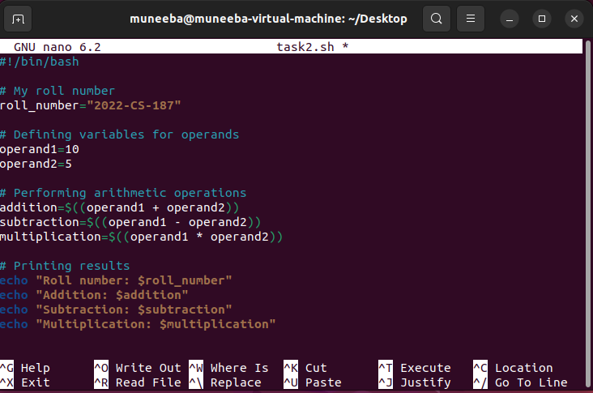

- Here's the result of above script.

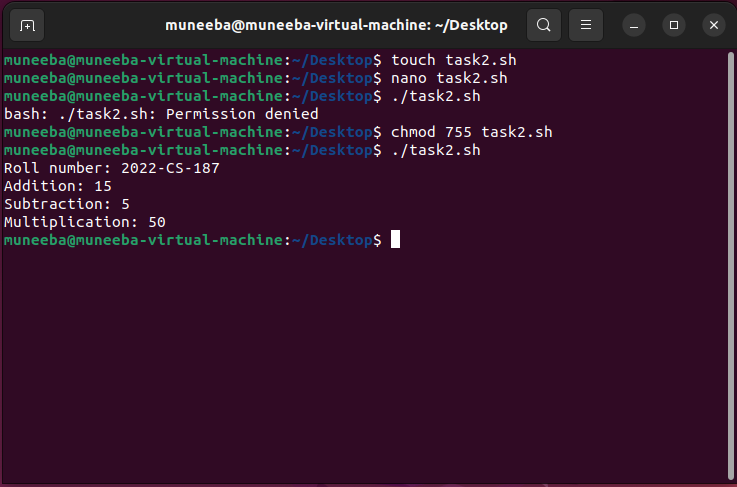

##### 2. Write a simple shell script that uses all relational operators with printing  your own roll # with the results of operations.

#### Script and Result of Question#2:

- Here's the Script uses all relational operators like:

- `-eq` (equal to)
- `-ne` (not equal to)
- `-gt` (greater than)
- `-lt` (less than)
- `-ge` (greater than or equal to)
- `-le` (less than or equal to)

-  It checks various relational conditions using if-else statements and prints the results accordingly.

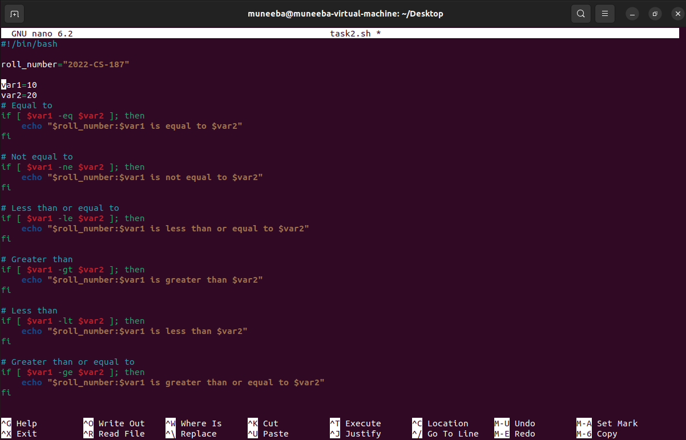

- Here's the result of above script.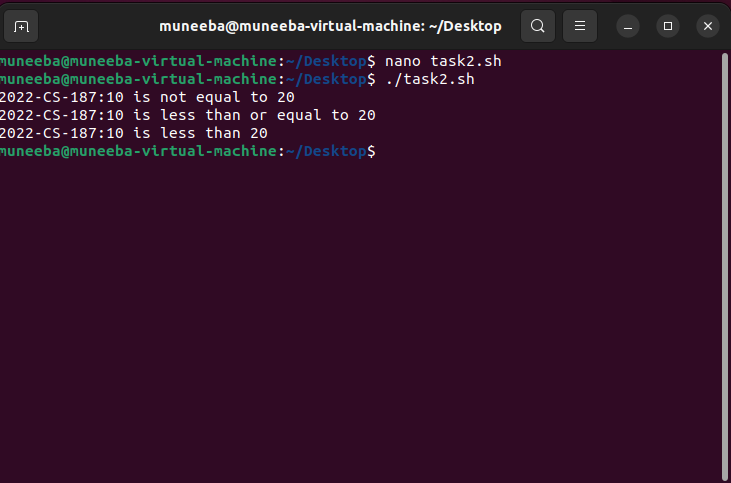

Hurrah!!!!!!!!!!! tasks completed.